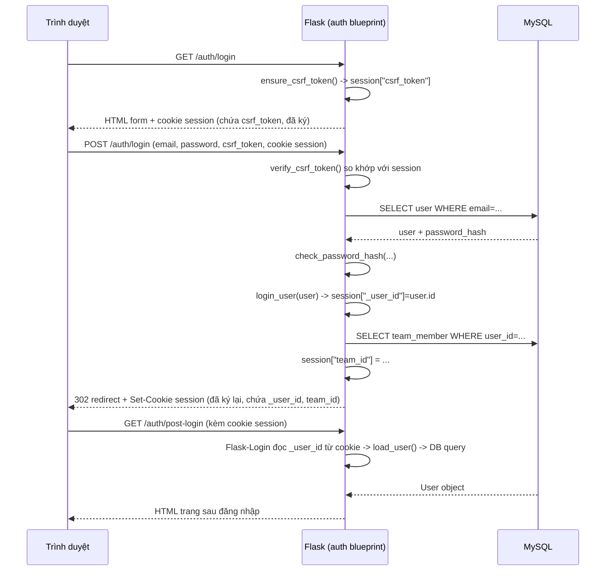

# Báo cáo chức năng Đăng nhập

2026-09-18

## 1. Tổng quan

Chức năng đăng nhập/đăng ký nằm trong blueprint `auth` (`app/auth/routes.py`, `app/auth/service.py`), dùng:

- **Flask-Login** — quản lý trạng thái "đã đăng nhập" của user trong session, bảo vệ route qua `@login_required`.
- **Session mặc định của Flask** (không dùng Flask-Session/Redis) — nơi thực sự lưu phiên đăng nhập.
- **werkzeug.security** — hash mật khẩu (`generate_password_hash`/`check_password_hash`), không lưu plaintext.
- **CSRF token thủ công** — tự viết trong `service.py`, chưa dùng Flask-WTF.
- **Flask-Limiter** — giới hạn 10 request/phút cho `POST /auth/login` và `POST /auth/register` (chống brute-force).

## 2. Cơ chế lưu phiên đăng nhập (quan trọng nhất)

### 2.1 Bản chất: session lưu ở phía client, không lưu ở server

Flask **mặc định không lưu session trên server**. Toàn bộ dữ liệu session (`flask.session`) được:

1. Serialize thành JSON
2. Ký (sign) bằng HMAC với `SECRET_KEY` (đọc từ `.env`, xem `config.py:9`) qua thư viện `itsdangerous`
3. Gửi cho trình duyệt dưới dạng **1 cookie duy nhất** tên `session`

Trình duyệt gửi lại cookie này ở mỗi request; Flask xác minh chữ ký (đảm bảo client không sửa được nội dung) rồi giải mã lại thành `dict` session.

**Hệ quả quan trọng:**
- Không có bảng `sessions` nào trong MySQL, không có key nào trong Redis lưu session — dù kiến trúc đề xuất ban đầu (`Đề xuất kiến trúc...md`, mục Redis) có nhắc tới việc dùng Redis để *"cache phiên đăng nhập"*. **Phần này hiện chưa implement** — Redis trong dự án hiện chỉ dùng cho rate-limit (`Flask-Limiter`) và làm sẵn cho SocketIO pub/sub, chưa dùng cho session.
- Vì session ký chứ không mã hoá, **không nên lưu dữ liệu nhạy cảm** trực tiếp vào session (hiện tại chỉ lưu id/role/token, là hợp lý).
- Đổi `SECRET_KEY` sẽ làm **toàn bộ session đang hoạt động bị vô hiệu ngay lập tức** (chữ ký không còn khớp) — cần lưu ý khi deploy/rotate secret.
- Không thể "thu hồi" (revoke) một session cụ thể từ phía server (vd. khi admin muốn ép 1 user logout từ xa) — vì server không giữ danh sách session nào đang tồn tại.

### 2.2 Nội dung cụ thể lưu trong session

| Key | Ai ghi | Khi nào | Mục đích |
| --- | --- | --- | --- |
| `_user_id` | Flask-Login (`login_user()`) | Lúc đăng nhập thành công | id của `User`, dùng để `user_loader` load lại object mỗi request |
| `_fresh` | Flask-Login | Lúc đăng nhập | Đánh dấu session "mới" (chưa từng qua remember-cookie) |
| `_id` | Flask-Login | Lúc đăng nhập | Hash định danh nội bộ của Flask-Login |
| `team_id` | `app/auth/service.py:login()` | Ngay sau `login_user()` | Team đang được chọn của user — dùng để lọc dữ liệu theo nguyên tắc multi-tenant ở các blueprint khác |
| `csrf_token` | `app/auth/service.py:ensure_csrf_token()` | Lần đầu load form GET (login/register) | Token 32-byte ngẫu nhiên, so khớp khi submit POST để chống CSRF; bị xoá (`session.pop`) ngay sau khi đăng nhập/đăng xuất thành công để xoay vòng |

Code liên quan: [app/auth/service.py](../app/auth/service.py)

```python
def login(user: User, remember: bool = False) -> None:
    login_user(user, remember=remember)
    session.pop("csrf_token", None)          # xoay token sau khi đăng nhập
    membership = TeamMember.query.filter_by(user_id=user.id).first()
    session["team_id"] = membership.team_id if membership else None
```

### 2.3 Cách Flask-Login load lại user mỗi request

`app/__init__.py`:

```python
@login_manager.user_loader
def load_user(user_id):
    return db.session.get(User, int(user_id))
```

Mỗi request có cookie `session` hợp lệ → Flask-Login đọc `_user_id` → gọi `load_user()` → **query MySQL 1 lần** để lấy lại object `User` đầy đủ → gán vào `flask_login.current_user`. Điều này có nghĩa: **mỗi request của user đã đăng nhập đều có 1 query MySQL** để load user (chưa cache — có thể tối ưu bằng Redis cache user object nếu cần sau này, đúng như mục (1) trong đề xuất Redis ban đầu).

### 2.4 "Ghi nhớ đăng nhập" (remember me)

Checkbox "Ghi nhớ đăng nhập" ở form login → `remember=True` → Flask-Login set thêm **1 cookie riêng** tên `remember_token`:
- Cookie session thường: hết hạn khi đóng trình duyệt (session cookie) hoặc theo `PERMANENT_SESSION_LIFETIME` (mặc định Flask: 31 ngày nếu `session.permanent = True`, nhưng project chưa set `permanent`).
- `remember_token`: mặc định Flask-Login TTL 365 ngày, ký riêng bằng `SECRET_KEY`, dùng để tự động tạo lại session (`_user_id`) khi cookie session đã hết nhưng remember_token còn hạn.

Hiện project **chưa cấu hình** `REMEMBER_COOKIE_DURATION` hay `PERMANENT_SESSION_LIFETIME` riêng — đang dùng mặc định của Flask/Flask-Login.

### 2.5 Đăng xuất

```python
def logout() -> None:
    logout_user()                  # Flask-Login: xoá _user_id/_fresh/_id khỏi session, xoá remember cookie
    session.pop("team_id", None)
    session.pop("csrf_token", None)
```

`logout_user()` không "xoá session ở server" (vì không có gì lưu ở server) mà đánh dấu cookie session gửi về trình duyệt là rỗng/hết hạn.

## 3. Luồng đăng nhập đầy đủ



## 4. Bảo mật đã có

| Cơ chế | Trạng thái |
| --- | --- |
| Hash mật khẩu (không lưu plaintext) | ✅ `werkzeug.security.generate_password_hash` |
| CSRF token cho form login/register | ✅ tự viết, so khớp bằng `secrets.compare_digest` |
| Rate limit chống brute-force | ✅ `Flask-Limiter`, 10 request/phút/IP cho POST login & register |
| Không lộ "email có tồn tại hay không" khi login sai | ✅ trả cùng 1 thông báo lỗi chung |
| Cookie session ký chống giả mạo nội dung | ✅ mặc định của Flask (itsdangerous) |
| Cookie `Secure` (chỉ gửi qua HTTPS) | ⚠️ chưa cấu hình tường minh — mặc định `False`, cần bật khi deploy production qua HTTPS |
| Cookie `SameSite` | ⚠️ mặc định Flask là `Lax`, chưa cấu hình tường minh trong `config.py` |
| Revoke session từ xa (vd. admin ép logout) | ❌ chưa làm được — do session không lưu server-side |

## 5. Khác biệt so với tài liệu kiến trúc ban đầu

Tài liệu `Đề xuất kiến trúc hệ thống & công nghệ...md` liệt kê Redis dùng cho *"cache phiên đăng nhập và dữ liệu Dashboard hay truy cập, giảm tải MySQL"*. Hiện trạng:

- Session đăng nhập **hoàn toàn nằm trong cookie ký (client-side)**, không đi qua Redis.
- Mỗi request của user đã đăng nhập vẫn **query MySQL** để load lại `User` (không cache).

Đây không phải lỗi — với quy mô 1 server như hiện tại, cookie session mặc định của Flask là lựa chọn hợp lệ và đơn giản, tương tự cách app/auth ở MVP thường làm. Nhưng nếu sau này cần:
- Thu hồi session tức thời (ép logout 1 thiết bị/user cụ thể),
- Hoặc giảm số query MySQL mỗi request,

thì nên bổ sung `Flask-Session` (backend Redis) để chuyển sang server-side session — khi đó cookie trình duyệt chỉ còn giữ 1 `session_id`, dữ liệu thật nằm trong Redis và có thể xoá/thu hồi theo ý muốn.

## 6. File liên quan

- [app/auth/routes.py](../app/auth/routes.py) — route GET/POST `/auth/login`, `/auth/register`, `/auth/logout`, `/auth/me`
- [app/auth/service.py](../app/auth/service.py) — logic xác thực, tạo/xoá session, CSRF
- [app/__init__.py](../app/__init__.py) — cấu hình `LoginManager`, `user_loader`
- [config.py](../config.py) — `SECRET_KEY` dùng để ký session
- [app/models.py](../app/models.py) — model `User`, `TeamMember`
