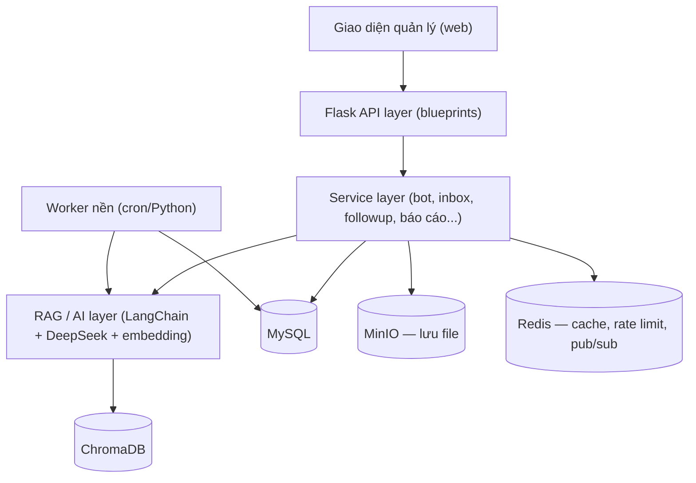
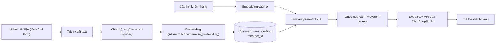
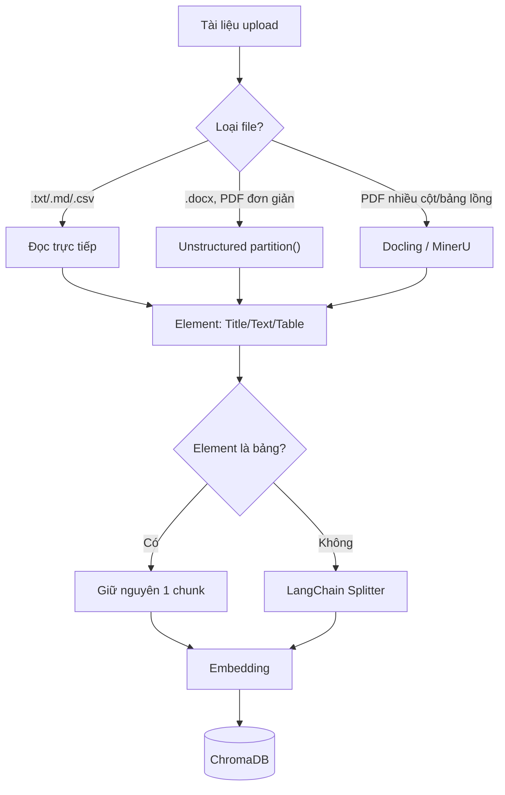

# Đề xuất kiến trúc hệ thống & công nghệ — Ứng dụng quản lý Chatbot AI

2026-09-18 · @Someone

## Phạm vi & nguyên tắc

Nền tảng công nghệ giữ nguyên như đã chọn: **Flask** (backend), **LangChain** (điều phối RAG), **DeepSeek API** (LLM). Tài liệu này đề xuất kiến trúc và giải pháp kỹ thuật để hiện thực hóa các màn hình đã dựng demo.

Theo yêu cầu, đề xuất này **không bao gồm** kiến trúc triển khai chatbot qua các kênh mạng xã hội bên ngoài (webhook/OAuth/định dạng tin nhắn riêng cho Facebook Messenger, Instagram, Zalo OA, WhatsApp, TikTok) — các kênh này giữ nguyên trạng thái "Đang phát triển" trên màn hình Xuất bản và sẽ có tài liệu kỹ thuật riêng khi cần. Kênh **Web Widget** (khung chat nhúng trên website) vẫn nằm trong phạm vi và được thiết kế đầy đủ ở đề xuất này, vì đây là phần thuộc chính ứng dụng Flask, không phụ thuộc API của bên thứ ba.

## Tổng quan kiến trúc hệ thống

Hệ thống chia 4 lớp: giao diện quản lý (các màn hình đã dựng demo) gọi API Flask, Flask gọi lớp service nghiệp vụ, lớp service gọi lớp RAG/AI khi cần trả lời tự động, và tất cả đọc/ghi qua lớp dữ liệu.



Ba nguyên tắc thiết kế chính:

1. **Multi-tenant theo `team_id`** — mọi bảng dữ liệu nghiệp vụ (bot, tài liệu, hội thoại, khách hàng...) đều gắn `team_id`, mọi truy vấn lọc theo team đang đăng nhập.
2. **Tách riêng xử lý nặng** — embedding tài liệu, gửi tin FollowUp hàng loạt, xuất báo cáo chạy nền (worker/cron), không chặn request người dùng.
3. **Module hóa theo blueprint** — mỗi nhóm chức năng (auth, bots, knowledge, inbox, followup, customers, reports, api\_tokens, profile) là một blueprint độc lập, dễ giao việc và kiểm thử riêng.

## Luồng RAG: xử lý & truy vấn cơ sở tri thức

LangChain có gói tích hợp chính thức cho DeepSeek (`langchain-deepseek`, class `ChatDeepSeek`), nên việc gọi DeepSeek qua LangChain không cần tự viết wrapper OpenAI-compatible thủ công. [ChatDeepSeek integration](https://docs.langchain.com/oss/python/integrations/chat/deepseek)



Bước upload -> embedding **nên chạy bất đồng bộ** (worker/cron quét cột `status`): tài liệu lớn có thể mất vài chục giây đến vài phút để chunk và embed, không nên giữ request HTTP chờ. Điều này khớp với trạng thái “Đang xử lý” / “Đã huấn luyện” đã có sẵn trong màn hình Cơ sở tri thức của demo. Mỗi bot nên có 1 collection ChromaDB riêng để tránh lẫn ngữ cảnh giữa các trợ lý.

### Chiến lược cắt chunk (chunking)

Giới hạn kỹ thuật cần tuân thủ trước tiên: **AITeamVN/Vietnamese\_Embedding** (fine-tune từ BAAI/bge-m3, 1024 chiều) tối đa **2048 token/lần embed** — chunk lớn hơn sẽ bị cắt cụt và mất nghĩa phần cuối. Ngược lại, DeepSeek (`deepseek-flash` / `deepseek-v4-pro`) có context 1 triệu token, output tối đa 384 nghìn, nên không phải nút thắt ở bước sinh câu trả lời — với top-k = 4–6 chunk mỗi lần truy vấn, tổng ngữ cảnh vẫn còn rất xa giới hạn này. [Vietnamese\_Embedding](https://huggingface.co/AITeamVN/Vietnamese_Embedding) · [DeepSeek pricing/context](https://api-docs.deepseek.com/quick_start/pricing)

| Thông số | Giá trị đề xuất |
| --- | --- |
| Kích thước chunk | 300–500 token (không vượt 2048 của embedding model) |
| Overlap giữa các chunk | 10–15% (\~40–75 token) |
| Top-k khi truy vấn | 4–6 chunk |

Cách cắt: dùng `RecursiveCharacterTextSplitter` của LangChain với `length_function` lấy từ tokenizer thật của Vietnamese\_Embedding (`AutoTokenizer.from_pretrained("AITeamVN/Vietnamese_Embedding")`) thay vì đếm ký tự, để đo đúng số token trước khi gọi API. Ưu tiên điểm cắt theo thứ tự giữ nghĩa: tiêu đề markdown (`##`, `###`) → xuống dòng đoạn (`\n\n`) → hết câu → chỉ cắt theo từ khi không còn lựa chọn nào khác.

Xử lý riêng cho bảng markdown (như bảng giá trong tài liệu mẫu `hanoiweb_knowledgebase_rag.md`): không cắt giữa bảng — giữ nguyên cả bảng làm 1 chunk nếu vừa kích thước, hoặc chia theo nhóm hàng và lặp lại tiêu đề bảng (ví dụ “Bảng giá dịch vụ”) ở đầu mỗi chunk con — nếu không, chunk đứng riêng sẽ mất ngữ cảnh đang nói về gì.

### Pipeline trích xuất & chunk — phối hợp nhiều thư viện theo loại tài liệu

Tách pipeline thành 2 bước độc lập: **trích xuất/nhận diện cấu trúc** theo loại file, rồi mới **chunk hóa** theo từng loại element đã trích xuất — không dùng 1 splitter chung cho mọi định dạng.



| Giai đoạn | Thư viện | Dùng khi | Đề xuất |
| --- | --- | --- | --- |
| Trích xuất text đơn giản | Đọc trực tiếp (không cần thư viện) | .txt/.md/.csv | MVP (08/10) |
| Trích xuất DOCX/PDF có cấu trúc | Unstructured | .docx, PDF 1 cột, ít bảng lồng — đúng với 5 file mẫu trong demo | MVP (08/10) |
| Trích xuất PDF phức tạp | Docling hoặc MinerU | PDF nhiều cột, bảng lồng, tài liệu doanh nghiệp dài | Giai đoạn 2, khi có tài liệu thật đủ phức tạp |
| Trích xuất PDF phức tạp (thay thế) | RAGFlow DeepDoc | Tương tự Docling/MinerU nhưng đi kèm cả platform RAGFlow | Không ưu tiên |
| Chunk văn bản thường | LangChain `MarkdownHeaderTextSplitter` + `RecursiveCharacterTextSplitter` | Mặc định cho mọi loại tài liệu | MVP (08/10) — đã có mã tham khảo ở trên |
| Chunk theo câu tiếng Việt chuẩn | LangChain + tokenizer câu tiếng Việt (`underthesea`) làm `length_function`/separator | Cần tách câu chính xác hơn đếm ký tự | Giai đoạn 2 |
| Chunk theo ngữ nghĩa | LangChain `SemanticChunker` (`langchain_experimental.text_splitter`) | Tài liệu dài, cần độ chính xác truy hồi cao | Giai đoạn 2 |
| Chunk phân cấp cha/con | LangChain `ParentDocumentRetriever` (`langchain.retrievers`) | RAG cần ngữ cảnh rộng (chunk cha) + truy hồi chính xác (chunk con nhỏ) | Giai đoạn 2 |

Toàn bộ pipeline — từ điều phối RAG, cắt chunk cơ bản, đến các kỹ thuật nâng cao (chunk theo ngữ nghĩa, phân cấp cha/con) — đều có sẵn trong hệ sinh thái LangChain (`langchain_experimental`, `langchain.retrievers`). **Không cần thêm LlamaIndex làm framework thứ hai** — giữ nguyên 1 framework LangChain xuyên suốt, đúng với lựa chọn nền tảng đã chốt. Bản MVP trước 08/10/2026 chỉ cần Unstructured (trích xuất) + `MarkdownHeaderTextSplitter`/`RecursiveCharacterTextSplitter` (chunk) là đủ cho 5 loại file đã có trong demo Cơ sở tri thức; `SemanticChunker` và `ParentDocumentRetriever` xếp vào lộ trình giai đoạn 2 khi cần nâng độ chính xác truy hồi, còn Docling/MinerU/RAGFlow DeepDoc xếp vào giai đoạn 2 khi tài liệu khách hàng thực tế đủ phức tạp.

### Chunk luôn xử lý ở server

Bản thân bước cắt chunk (chia text thành đoạn \~300–500 token) rất nhẹ về tính toán — không phải chỗ tốn tài nguyên server. Hai bước thật sự nặng trong pipeline là (1) trích xuất cấu trúc PDF/DOCX phức tạp (Unstructured/Docling/MinerU — chỉ chạy được ở Python, chưa có bản JS đủ tin cậy để làm trong trình duyệt) và (2) embedding (suy luận qua mô hình AITeamVN/Vietnamese\_Embedding, cần chạy nhất quán 1 phiên bản model). Vì vậy chuyển riêng bước chunk sang client sẽ **không giảm đáng kể tải server**.

Tất cả chunk — kể cả với `.txt/.md/.csv` — đều được tạo ở server (Flask), không phân biệt theo loại file. Lý do: chỉ duy trì **1 bộ logic chunk duy nhất** (đúng tokenizer thật của Vietnamese\_Embedding + bộ separator đã thiết kế ở mục trước), thay vì phải viết lại bằng JS rồi giữ đồng bộ với bản Python — tránh trường hợp 2 bên tính ra kết quả chunk khác nhau.

Sau khi upload, tài liệu được xử lý bất đồng bộ ở server (job nền đã nêu ở mục Luồng RAG) → tạo chunk → admin xem/sửa lại qua màn hình “Chỉnh sửa tài liệu” nếu cần — mọi lần sửa đều đi qua lại server để tính lại token bằng đúng tokenizer trước khi lưu, không tính ở trình duyệt.

| Bước | Nơi xử lý | Lý do |
| --- | --- | --- |
| Trích xuất PDF/DOCX (Unstructured/Docling/MinerU) | Server | Chỉ có ở Python, cần xử lý layout/bảng chính xác |
| Cắt chunk (mọi loại file, kể cả .txt/.md/.csv) | Server | Dùng đúng 1 bộ logic + tokenizer thật, tránh lệch kết quả giữa client/server |
| Embedding | Server | Cần chạy nhất quán 1 phiên bản model, chi phí tính toán cao |

Nguyên tắc: chunk luôn được tạo và tính token ở server bằng đúng tokenizer của model embedding. Admin có thể xem & sửa nội dung chunk qua màn hình “Chỉnh sửa tài liệu”, nhưng mỗi lần sửa server sẽ tính lại token trước khi embed để đảm bảo không vượt giới hạn 2048 token.

### Triển khai chuẩn với LangChain (mã tham khảo)

Dùng 2 bước nối tiếp: `MarkdownHeaderTextSplitter` để tách theo mục/heading trước (giữ ngữ cảnh, sinh metadata), rồi `RecursiveCharacterTextSplitter` với `length_function` đo token thật để cắt nhỏ tiếp từng mục — không dùng 1 bước `split_text()` thô trên toàn văn bản.

```python
from transformers import AutoTokenizer
from langchain_text_splitters import (
    MarkdownHeaderTextSplitter,
    RecursiveCharacterTextSplitter,
)
from langchain_core.documents import Document

# 1) Tokenizer đúng của model embedding đang dùng — đo token thật, không đếm ký tự
tokenizer = AutoTokenizer.from_pretrained("AITeamVN/Vietnamese_Embedding")

def count_tokens(text: str) -> int:
    return len(tokenizer.encode(text, add_special_tokens=False))

# 2) Bước 1 — tách theo heading markdown để giữ ngữ cảnh mục lục
header_splitter = MarkdownHeaderTextSplitter(
    headers_to_split_on=[("#", "h1"), ("##", "h2"), ("###", "h3")],
    strip_headers=False,   # giữ nguyên tiêu đề trong nội dung chunk
)
sections = header_splitter.split_text(markdown_text)

# 3) Bước 2 — tách nhỏ tiếp từng mục theo token, có overlap
splitter = RecursiveCharacterTextSplitter(
    chunk_size=450,          # đơn vị: token (qua length_function), không phải ký tự
    chunk_overlap=60,        # ~13% overlap
    length_function=count_tokens,
    separators=["\n\n", "\n", ". ", "! ", "? ", " ", ""],
)

chunks: list[Document] = []
for section in sections:
    if is_table_block(section.page_content):        # bảng markdown giữ nguyên, không cắt
        chunks.append(section)
        continue
    heading_path = format_heading_path(section.metadata)  # ví dụ: "Bảng giá dịch vụ"
    for piece in splitter.split_text(section.page_content):
        chunks.append(Document(
            page_content=f"{heading_path}\n\n{piece}",   # lặp lại đường dẫn heading để chunk đứng riêng vẫn có ngữ cảnh
            metadata=section.metadata,
        ))

assert all(count_tokens(c.page_content) <= 2048 for c in chunks)  # kiểm tra trước khi embed
```

`is_table_block()` và `format_heading_path()` là 2 hàm tự viết: hàm đầu nhận diện đoạn bằng regex bắt đầu bằng `|` (bảng markdown), hàm sau nối `h1 > h2 > h3` từ metadata của `MarkdownHeaderTextSplitter` thành 1 dòng tiêu đề ngắn.

Với nội dung trích từ PDF/DOCX qua Unstructured (không có sẵn heading markdown): thay `MarkdownHeaderTextSplitter` bằng bước tự gom nhóm — mỗi `Title` element làm 1 “mục”, các `NarrativeText` đi sau nó gán vào cùng nhóm cho đến `Title` tiếp theo, rồi đưa từng nhóm qua cùng `RecursiveCharacterTextSplitter` ở trên; `Table` element luôn giữ nguyên như chunk riêng, không qua splitter.

Nên viết unit test riêng cho bước này: kiểm tra không chunk nào vượt 2048 token, chunk nào là bảng không bị cắt giữa chừng, và tổng số chunk hợp lý với từng file mẫu đã có trong demo (ví dụ `hanoiweb_knowledgebase_rag.md`).

## Lưu trữ file: có cần MinIO không?

**Dùng MinIO ngay từ đầu**, theo lựa chọn của bạn. So với đĩa cục bộ, MinIO tốn thêm khoảng nửa ngày để cài đặt/cấu hình bucket nhưng đổi lại có backup/versioning sẵn có và sẵn sàng scale nhiều server sau này — hợp lý nếu bạn muốn tránh phải migrate lại sau khi đã có dữ liệu thật.

| Tiêu chí | Đĩa cục bộ | MinIO / S3 |
| --- | --- | --- |
| Thời gian triển khai | Nhanh, không cần thêm service | Cần cài đặt, cấu hình bucket/policy |
| Phù hợp quy mô | 1 server, vài trăm MB–vài GB tài liệu/team | Nhiều server, cần chia sẻ file giữa các instance |
| Backup / versioning | rsync + cron thủ công | Có sẵn replication, versioning |
| Upload trực tiếp từ browser | Không, phải qua Flask | Có (presigned URL), giảm tải server |
| Chi phí vận hành | Thấp | Thêm 1 service, thêm RAM/CPU |

Triển khai cụ thể: vẫn viết lớp `StorageService` (`save_file` / `get_file` / `get_presigned_url`) nhưng implement mặc định bằng MinIO (SDK `minio` cho Python), để code nghiệp vụ (knowledge, avatar, xuất báo cáo) không gọi trực tiếp SDK MinIO ở nhiều nơi.

- Chạy MinIO như 1 service riêng cạnh Flask (cùng Docker Compose), tạo bucket riêng theo môi trường (`aichatbot-dev`, `aichatbot-prod`).
- Cấu trúc object key giữ như đĩa cục bộ: `{team_id}/{bot_id}/{document_id}/{filename}` để dễ tra cứu và xóa theo bot.
- Với tài liệu lớn (PDF/DOCX), dùng presigned URL để trình duyệt upload thẳng lên MinIO, giảm tải băng thông qua Flask; Flask chỉ nhận callback để kích hoạt job embedding.
- Access key/secret key và endpoint để trong biến môi trường, không hạ cứng.

Phần này nên làm cùng Tuần 1 (hạ tầng nền) thay vì Tuần 2, vì cần có MinIO chạy sẵn trước khi xây RAG pipeline ở bước Cơ sở tri thức.

## Mô hình dữ liệu & lựa chọn cơ sở dữ liệu

MySQL vẫn là nguồn sự thật cho dữ liệu nghiệp vụ, ChromaDB chỉ lưu vector cho truy vấn ngữ nghĩa.

| Bảng | Mục đích |
| --- | --- |
| `teams` | Tổ chức/team, gói cước, hạn sử dụng |
| `users` | Người dùng, liên kết team qua `team_members` (role) |
| `bots` | Trợ lý AI, thuộc 1 team |
| `bot_settings` | Lời chào, hướng dẫn/tính cách, ngôn ngữ, temperature |
| `documents` | Tài liệu cơ sở tri thức: tên file, đường dẫn lưu trữ, `status` (pending/processing/trained), kích thước |
| `conversations` / `messages` | Hội thoại và tin nhắn (dùng chung cho Inbox và Lịch sử chat, lọc theo thời gian/trạng thái) |
| `followups` | Kịch bản nhắc tự động, lịch gửi |
| `customers` | Thông tin khách hàng thu thập được từ hội thoại |
| `api_tokens` | Token tích hợp ngoài, kèm scope |

Redis được tích hợp làm thành phần hạ tầng dùng chung ngay từ đầu, phục vụ 3 việc: (1) cache phiên đăng nhập và dữ liệu Dashboard hay truy cập, giảm tải MySQL; (2) rate limit theo `api_tokens` qua Flask-Limiter (đếm tập trung, đúng khi chạy nhiều worker); (3) pub/sub cho sự kiện real-time (Flask-SocketIO) khi Inbox cần đẩy tin nhắn mới cho nhân viên.

### SQLAlchemy ORM có phù hợp không?

**Phù hợp** — đây là lựa chọn tiêu chuẩn đi cùng Flask, và khớp tốt với mô hình dữ liệu nhiều quan hệ ở trên (`teams` → `bots` → `documents`/`conversations` → `messages`): khai báo `relationship()` giữa các model giúp truy vấn lồng nhau (ví dụ liệt kê bot kèm số tài liệu) mà không phải tự viết JOIN tay, và Flask-Migrate (Alembic) đọc trực tiếp từ model để sinh migration — phù hợp với tốc độ thay đổi schema cần có trước 08/10/2026.

2 điểm cần lưu ý khi dùng:

- **Báo cáo/thống kê** (Dashboard tổng quan, màn hình Báo cáo): các câu COUNT/GROUP BY theo thời gian nên viết bằng SQLAlchemy Core (`db.session.execute(select(...).group_by(...))`) thay vì lấy hết object rồi đếm ở Python — nhanh hơn và không tốn bộ nhớ hydrate object không cần thiết.
- **Tránh N+1 query**: khi liệt kê bot kèm số tài liệu, hoặc hội thoại kèm thông tin khách hàng, dùng `joinedload()`/`selectinload()` để load quan hệ trong 1 truy vấn thay vì để ORM tự động query thêm cho từng dòng.

Ở quy mô 1 server MySQL như hiện tại, SQLAlchemy ORM không phải điểm nghẽn hiệu năng — chỉ cần áp 2 lưu ý trên đúng chỗ.

## Kiến trúc backend Flask

Cấu trúc thư mục theo blueprint, mỗi nhóm chức năng tách `routes.py` (API layer) và `service.py` (nghiệp vụ), dùng chung `core/`:

```
app/
  auth/          routes.py, service.py
  bots/          routes.py, service.py   (Thiết lập)
  knowledge/     routes.py, service.py   (Cơ sở tri thức)
  inbox/         routes.py, service.py   (Inbox + Lịch sử chat)
  followup/      routes.py, service.py
  customers/     routes.py, service.py
  reports/       routes.py, service.py
  api_tokens/    routes.py, service.py
  profile/       routes.py, service.py
extensions.py     khởi tạo & quản lý TẤT CẢ kết nối dùng chung (MySQL, ChromaDB, MinIO, Redis, SocketIO)
core/
  rag_engine.py       chunk, embedding, truy vấn ChromaDB
  llm_client.py        wrap ChatDeepSeek (langchain-deepseek)
  storage_service.py   lớp trừ tượng lưu file (MinIO)
workers/
  process_documents.py  job embedding chạy nền
  send_followups.py     job gửi FollowUp theo lịch
```

Có — tất cả kết nối (MySQL, ChromaDB, MinIO, Redis, SocketIO) được tạo đúng 1 lần trong `extensions.py` và khởi tạo tập trung trong application factory (`create_app()`), thay vì để mỗi blueprint/route tự mở kết nối riêng — đảm bảo dùng chung 1 connection pool cho mỗi service, tránh rò rỉ kết nối và dễ mock khi viết test.

```python
# extensions.py — mỗi client tạo 1 lần, dùng chung toàn app
from flask_sqlalchemy import SQLAlchemy
from flask_socketio import SocketIO
import chromadb
import redis
from minio import Minio
import os

db = SQLAlchemy()                 # MySQL, qua SQLAlchemy engine + connection pool
socketio = SocketIO()             # Realtime, message_queue trỏ về Redis khi chạy >1 worker
redis_client = redis.Redis.from_url(os.environ["REDIS_URL"], decode_responses=True)
chroma_client = chromadb.HttpClient(host=os.environ["CHROMA_HOST"], port=8000)
minio_client = Minio(
    os.environ["MINIO_ENDPOINT"],
    access_key=os.environ["MINIO_ACCESS_KEY"],
    secret_key=os.environ["MINIO_SECRET_KEY"],
    secure=os.environ.get("MINIO_SECURE", "false") == "true",
)
```

```python
# app/__init__.py — application factory, khởi tạo 1 lần khi app start
from flask import Flask
from extensions import db, socketio

def create_app():
    app = Flask(__name__)
    app.config.from_object("config.Config")

    db.init_app(app)
    socketio.init_app(app, message_queue=app.config["REDIS_URL"])  # pub/sub qua Redis khi nhiều worker

    from app.auth.routes import bp as auth_bp
    from app.bots.routes import bp as bots_bp
    # ... đăng ký các blueprint còn lại (knowledge, inbox, followup, customers, reports, api_tokens, profile)
    app.register_blueprint(auth_bp)
    app.register_blueprint(bots_bp)

    return app
```

`redis_client`, `chroma_client`, `minio_client` là client thuần (không phải Flask extension) nên không cần `.init_app()` — các service/route cần dùng chỉ `from extensions import redis_client` (hoặc `chroma_client`, `minio_client`) trực tiếp.

Xử lý bất đồng bộ: giữ đúng hướng đã có trong kế hoạch (cron + Python job quét bảng `documents`/`followups` theo `status`) — đủ đơn giản để kịp hạn 08/10/2026, không cần thêm Celery ngay. Nếu sau này cần xử lý realtime hơn (nhiều tenant, nhiều job đồng thời) có thể nâng cấp sang Celery + Redis mà không đổi cấu trúc thư mục trên.

### Real-time hay theo lịch (cron)?

Trả lời AI cho khách hàng **là real-time**: mỗi tin nhắn gửi lên `POST /widget/api/<bot_id>/messages` được xử lý đồng bộ ngay trong request — gọi thẳng `rag_engine` rồi DeepSeek API, khách nhận câu trả lời sau vài giây, không qua hàng đợi hay cron.

cron/worker chỉ dùng cho 2 việc **không cần phản hồi tức thì**: embedding tài liệu khi upload (chạy nền vì có thể mất vài chục giây–vài phút) và gửi FollowUp theo lịch đã đặt trước.

Riêng màn hình Inbox/Lịch sử chat cho nhân viên: dùng Flask-SocketIO (WebSocket) để tin nhắn mới hiện ngay không cần tải lại trang, phát sự kiện theo `bot_id`/`team_id`. Redis làm message broker/pub-sub cho SocketIO để các worker Flask đồng bộ sự kiện với nhau — cần thiết ngay từ khi chạy nhiều hơn 1 worker, không phải thêm sau.

Rate limit cho API Token: dùng `Flask-Limiter`, giới hạn theo từng token và theo scope (ví dụ scope `message` cần giới hạn chặt hơn `Xem`).

## Xác thực, phân quyền & API Tokens

Người dùng đăng nhập bằng session (Flask-Login), mỗi user thuộc 1 hoặc nhiều `teams` qua bảng `team_members` với role `Owner` / `Admin` / `Member`; mọi request nghiệp vụ đều lọc theo `team_id` đang chọn (khớp nguyên tắc multi-tenant ở phần Tổng quan).

API Token (màn hình ApiTokens trong demo) lưu riêng, không dùng chung cơ chế session:

| Trường | Mô tả |
| --- | --- |
| `token_hash` | Hash của token, không lưu plain text |
| `scopes` | JSON danh sách quyền: `Xem`, `Tạo`, `Cập nhật`, `Xóa`, `message` |
| `team_id` | Token thuộc team nào |
| `expiry` | Hạn sử dụng (tùy chọn) |
| `last_used_at` | Phục vụ giám sát/thu hồi |

Mỗi request qua API Token đi qua middleware kiểm scope trước khi vào service layer — dùng chung hạ tầng xác thực với user thường nhưng không qua session.

## Ánh xạ kiến trúc theo từng màn hình chức năng

| Màn hình demo | Chức năng chính | Thành phần backend |
| --- | --- | --- |
| Đăng nhập | Xác thực | `auth` blueprint, session |
| Bảng điều khiển | Tổng quan bot, 4 thẻ bước | Truy vấn tổng hợp từ `bots` + `documents` + `conversations` |
| Thiết lập | Cấu hình hành vi bot | Bảng `bot_settings` |
| Cơ sở tri thức | Upload/sửa tài liệu | `storage_service` + `rag_engine` (job embedding nền) |
| Lịch sử chat & Inbox | Xem/phản hồi hội thoại | `conversations`/`messages`, lọc theo kênh/trạng thái |
| Xuất bản — Web Widget | Nhúng khung chat lên website khách hàng | Xem chi tiết bên dưới |
| FollowUp | Kịch bản nhắc tự động | `followups` + worker gửi theo lịch |
| Khách hàng | CRM cơ bản | `customers` liên kết `conversations` |
| Báo cáo | Thống kê | Truy vấn aggregate hoặc bảng cache báo cáo |
| API Tokens | Tích hợp ngoài (CRM/ERP/Ecommerce) | `api_tokens` |
| Hồ sơ | Thông tin user/team, gói cước | `users`/`teams`/`subscriptions` |

### Kiến trúc Web Widget (kênh duy nhất xây đầy đủ giai đoạn này)

Web Widget là 1 đoạn JS (`embed.js`) nhúng vào website khách hàng, không phụ thuộc nền tảng bên thứ ba nên thuộc chính ứng dụng Flask:

- `GET /widget/embed.js?bot_id=...` — trả về script nhúng tĩnh, đọc từ file static, không cần auth.
- `POST /widget/api/<bot_id>/messages` — endpoint public (CORS mở theo domain đã khai báo cho bot) nhận tin nhắn từ khách, tạo/nối `conversation` với kênh = `web_widget`, gọi thẳng `rag_engine` để trả lời — không đi qua lớp xác thực người dùng nội bộ.
- Danh tính phiên khách được giữ bằng 1 `visitor_id` sinh ra ở trình duyệt (cookie/localStorage phía widget), gắn vào `conversation` để nhận ra khách quay lại.
- Các kênh Facebook/Instagram/Zalo/WhatsApp/TikTok dùng chung bảng `conversations`/`messages` (cột `channel`) nhưng phần nhận webhook từng nền tảng chưa thiết kế ở tài liệu này — giao diện Xuất bản hiển thị các kênh này ở trạng thái “Đang phát triển” cho đến khi có thiết kế riêng.

## Hạ tầng triển khai, vận hành & lộ trình

Giữ Nginx làm reverse proxy + TLS như kế hoạch hiện có; đóng gói Flask app bằng Docker để triển khai lại nhanh và đồng nhất môi trường (dev/staging/production giống nhau). Log xoay vòng theo file là đủ cho giai đoạn này; backup MySQL + thư mục `uploads/` hàng ngày qua cron, giữ tối thiểu 7 bản gần nhất.

Lộ trình kỹ thuật đề xuất từ 18/09 đến hạn chót 08/10/2026:

| Giai đoạn | Nội dung |
| --- | --- |
| Tuần 1 (18–24/9) | Schema MySQL, `auth`, CRUD team/bot, `bot_settings`, dựng service MinIO + Redis (Docker Compose) + `StorageService` |
| Tuần 2 (25/9–1/10) | RAG pipeline (upload, chunk, embedding, truy vấn) lưu file qua MinIO, Inbox real-time qua Flask-SocketIO + Redis, Lịch sử chat, Web Widget (`embed.js` + endpoint public) |
| Tuần 3 (2–8/10) | FollowUp, Khách hàng, Báo cáo, API Tokens (rate limit qua Redis), kiểm thử & triển khai production |

Rủi ro lớn nhất là thời gian embedding/RAG chiếm nhiều tuần 2 — nên làm trước, song song với Inbox, thay vì làm tuần tự.
