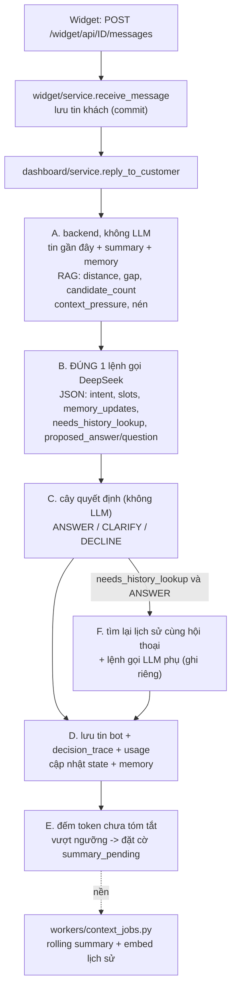

# Context & Response Decision Engine

Thay luồng RAG cũ (search top-5 → nối 1 chuỗi prompt → gọi LLM) ở **Pha B — trả lời khách**. Không đụng luồng nạp tri thức
(Pha A). Mã ở `core/context_engine/`; `core/rag_engine.py` giữ phần truy xuất (RAG Controller).

## 1. Luồng 1 lượt trả lời

Số lệnh gọi DeepSeek mỗi lượt: **1** (chính). Ngoại lệ được ghi riêng: gọi lại khi JSON lỗi (`retry`), Bước F
(`history_lookup`), tóm tắt nền (`summary`). Thống kê nằm trong `messages.decision_trace` (`main_llm_calls`,
`extra_llm_calls`) và `messages.usage_*` (chỉ lệnh gọi chính).

## 2. Cây quyết định (Bước C) — `decision.py`

Thứ tự ưu tiên, nhánh đầu khớp thì dừng:

| # | Điều kiện | Quyết định |
| --- | --- | --- |
| 1 | KB bật + có chunk trong kho + `candidate_count == 0` | CLARIFY/DECLINE bằng **câu chủ bot cấu hình** (không dùng `proposed_answer`) |
| 1b | tổng chunk tìm được **vượt** "Ngân sách token cho thông tin tra cứu" và còn lượt hỏi làm rõ | CLARIFY thu hẹp phạm vi: LLM chỉ nhận **phần mở đầu của từng chunk** và phải đặt 1 câu hỏi thu hẹp (`context_exceeds_budget`). Khách nêu rõ hơn → tìm lại → nếu tổng chunk **vừa ngân sách thì trả lời trực tiếp**; còn vượt thì hỏi tiếp, tối đa `max_clarification_turns` lượt, hết lượt thì trả lời từ các chunk liên quan nhất còn vừa ngân sách |
| 2 | `intent_confidence < ngưỡng` | CLARIFY (`proposed_clarification_question`) |
| 3 | intent có `required_slots` và `slot_completion < ngưỡng` | CLARIFY |
| 4 | `candidate_count > max_candidate_count` và `distance_gap` nhỏ | CLARIFY thu hẹp |
| — | áp lực ngữ cảnh cao | **không bao giờ** là lý do CLARIFY — nén ở Bước A (xem 4) |
| 6 | còn lại | ANSWER |

CLARIFY bị ép ANSWER khi hết `max_clarification_turns` (kèm ghi chú lịch sự nếu `self_assessed_confidence` thấp) — riêng nhánh 1
thì ép thành DECLINE (không bao giờ trả lời tự tin từ ngữ cảnh dưới ngưỡng). `clarification_turns_used` là số lượt CLARIFY
**liên tiếp**, về 0 khi ANSWER/DECLINE.

## 3. Truy xuất (RAG Controller)

`query top_k → lọc khoảng cách → loại trùng → tín hiệu → giữ rerank_top_n → mở rộng lân cận → cắt theo ngân sách token`.

**Đơn vị khoảng cách (đã đo, không suy đoán):** collection Chroma dùng `space=l2`; Chroma trả **bình phương** L2 nên với vector
đã chuẩn hóa `d = 2·(1−cos)` (khớp tới 4 chữ số thập phân trên 12 truy vấn thật). Do đó `cos = 1 − d/2`; công thức
`1 − d²/2` sẽ sai. `d` NHỎ = liên quan; chunk có `d` LỚN HƠN ngưỡng bị loại.

Mặc định `rag_distance_threshold = 1.50` (≡ cosine 0,25, đúng ngưỡng đã đo trước đây). Số đo thật: câu hỏi đúng chủ đề `d ≈ 0,87–1,48`;
lạc đề `d ≥ 1,58`. Giá trị 0,70 đề xuất ban đầu (≡ cosine 0,65) sẽ loại gần như mọi chunk. `DISTANCE_GAP_SMALL = 0,05`
(khoảng cách hạng 1–2 đo được 0,03–0,46).

`candidate_count` = số **vùng nội dung** khác nhau đạt ngưỡng sau loại trùng (các chunk trúng liền kề trong cùng tài liệu gộp
thành 1 vùng), đếm **trước** khi cắt còn `rerank_top_n`.

**Thu hẹp phạm vi khi vượt ngân sách** (`builder.refit_rag`, `rag_engine.excerpt_passages`): ngân sách = `min(AVAILABLE_RAG_TOKENS,
rag_max_context_tokens)`. Tổng token các chunk **trúng** (không tính chunk lân cận) vượt ngân sách → mỗi chunk trúng được cắt còn phần
mở đầu (chia đều token, chunk ngắn giữ nguyên và phần dư chia cho chunk dài; quá nhiều chunk tới mức mỗi chunk chưa được
`MIN_EXCERPT_TOKENS`=24 token thì chỉ giữ các chunk liên quan nhất) sao cho tổng vừa ngân sách; prompt thêm chỉ dẫn "đừng trả lời,
hãy hỏi 1 câu thu hẹp phạm vi". Truy xuất lượt sau dùng câu hỏi hiện tại của khách (không viết lại theo ngữ cảnh), nên câu trả lời thu
hẹp cần đủ ý để tìm ra đúng chunk.

"Rerank": chỉ có 1 model embedding trong tiến trình và không có cross-encoder nào trên đĩa; cosine tính từ khoảng cách L2 là hàm
đơn điệu nên **không đổi thứ hạng** — bước này thực chất là cắt còn `rerank_top_n`. Rerank ngữ nghĩa thật cần model mới.

## 4. Context Builder

- `RecentMessageSelector`: tối đa `recent_message_limit` tin, dừng khi vượt `recent_token_limit`; bỏ tin nhân viên và tin đã nằm
  trong summary; gộp tin liền cùng vai.
- `AVAILABLE_RAG_TOKENS = max_context − system − memory − summary − recent − question − (max_tokens + 600)`; trần RAG =
  `min(AVAILABLE_RAG_TOKENS, rag_max_context_tokens)`. `600` = dự phòng cho phần JSON có cấu trúc.
- Áp lực = token đầu vào / `max_context_tokens`: `<0,60` bình thường · `0,60–warning` nén nhẹ (chỉ nội dung RAG) ·
  `warning–hard` nén mạnh · `>hard` nén tối đa. Thứ tự nén: bỏ đoạn lặp → bỏ chunk điểm thấp → nén nội dung chunk → giảm tin
  lịch sử (tối đa còn một nửa) → dùng summary thay tin thô (chỉ khi có summary). Nếu RAG không còn chỗ, bỏ thêm lịch sử để
  nhường chỗ cho tài liệu; chỉ khi vẫn không còn chỗ mới coi như "không có ngữ cảnh".
- Bố cục message: `system` (chỉ dẫn + quy tắc + hợp đồng JSON + intent, rồi summary + memory) → tin gần đây xen kẽ
  `user/assistant` → `user` cuối (RAG + câu hỏi). Phần tĩnh đứng đầu để hưởng Context Caching của DeepSeek.

## 5. Dữ liệu & migration

| Revision | Nội dung |
| --- | --- |
| `1a2b3c4d5e01` | 27 cột cấu hình engine trên `bot_settings` (mọi cột có `server_default`); **backfill** `rag_distance_threshold = 2·(1−min_similarity)` và chuyển bot đã chỉnh `min_similarity` sang tier `advanced` để không mất tùy chỉnh |
| `1a2b3c4d5e02` | `conversation_state`, `structured_memory`, `bot_intent_config` |
| `1a2b3c4d5e03` | `messages.decision_trace` + `usage_*` |
| `1a2b3c4d5e04` | `conversation_message_embeddings` (vector nằm ở Chroma `history_<bot_id>`) |

Cột thêm ngoài đặc tả (cần thiết): `bot_settings.rag_enabled` (công tắc Knowledge Base của tier basic) và
`conversation_state.summary_pending` (cờ việc nền). Cột `min_similarity` được giữ nhưng engine không còn đọc.

## 6. Tier cấu hình (Bước 1)

`basic`: 3 công tắc (bộ nhớ hội thoại · Knowledge Base · AI hỏi làm rõ), `recent_message_limit` cố định 10.
`advanced`: thêm `recent_message_limit`, `summary_trigger_tokens`, `rag_max_context_tokens`, `rag_top_k`,
`rag_distance_threshold`, `max_clarification_turns`. `expert`: toàn bộ. **Trường không thuộc tier hiện tại luôn dùng mặc định**
(`settings.EngineSettings.from_model`) — hạ tier không để lại giá trị ẩn.

## 7. Chi phí ước tính mỗi câu hỏi (Bước 1)

Ô "Chi phí ước tính mỗi câu hỏi" ở cuối card *Trả lời thông minh* gọi `POST /bots/<id>/setup/cost-estimate` mỗi khi đổi
cấu hình (chưa cần lưu; không ghi gì). Server dùng đúng `parse_engine_form` + quy tắc tier như khi lưu (giá trị sai báo lỗi giống
hệt), rồi `core/context_engine/cost_estimate.py` tính theo giá trong `docs/BANG_GIA_API_AI.md` (cache-hit / cache-miss / output tính
riêng, 1 USD = 26.200 VND, có giá cao điểm và ngoài cao điểm).

- **Thấp nhất**: đầu hội thoại (không tóm tắt, bộ nhớ, tin cũ), không tìm được tài liệu, câu hỏi/đáp ngắn, phần chỉ dẫn cố định
  trúng cache (làm tròn xuống khối 128 token).
- **Cao nhất**: mọi phần động đầy tới trần cấu hình — tin gần đây `min(recent_token_limit, …)`, tóm tắt `summary_max_tokens`, bộ nhớ
  `memory_max_items`, tài liệu `min(rag_max_context_tokens, còn lại của max_context_tokens, top_n × 3 chunk)` — đầu ra
  `max_tokens + 600`, không trúng cache. Tổng đầu vào bị chặn ở `max_context_tokens`.
- Ngoài khoảng trên: (1) lệnh gọi lại hiếm gặp (JSON lỗi / tra cứu lại lịch sử) cộng thêm tối đa 1 lệnh gọi cỡ cận trên; (2) tóm tắt
  nền tính riêng mỗi lần chạy, không chia vào từng câu hỏi.
- **Là ước lượng**: token đếm bằng tokenizer của model embedding; các giả định không có số đo (câu hỏi ngắn nhất 10 token, câu trả
  lời ngắn nhất 20 token, bản tóm tắt ngắn nhất 50 token, 3 ký tự/token cho câu hỏi dài nhất) là hằng số đặt tên ở đầu `cost_estimate.py`.
  Số thật luôn là `usage` DeepSeek lưu ở `messages.usage_*` (`cost.py`).
- Đổi bảng giá/tỷ giá: sửa hằng số ở đầu `cost_estimate.py` cùng lúc với `docs/BANG_GIA_API_AI.md`.

## 8. Vận hành

- Áp migration: `flask db upgrade` (chỉ thêm cột/bảng, có mặc định an toàn). **Phải áp trước khi chạy code mới** — code mới
  đọc các cột này ở mọi lượt trả lời.
- Việc nền chạy nhúng trong `python run.py` (`EMBEDDED_WORKER=true`) hoặc riêng `python -m workers.context_jobs`; khoá Redis
  `context-jobs-worker-lock` (riêng, không chung với worker tài liệu). Lần đầu chạy, worker **embed bù toàn bộ tin nhắn cũ**.
- Chi phí: `core.context_engine.cost.team_usage_summary(team_id, since)`. Chưa có bảng subscriptions/quota nên chưa chặn khi vượt hạn mức.
- `decision_trace` đã lưu đầy đủ mỗi tin bot; chưa có UI xem lại.
- Kiểm thử: xem `tests/README.md`.
