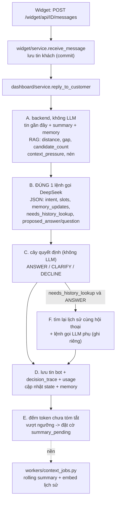

# Context & Response Decision Engine

Thay luồng RAG cũ (search top-5 → nối 1 chuỗi prompt → gọi LLM) ở **Pha B — trả lời khách**. Không đụng luồng nạp tri thức
(Pha A). Mã ở `core/context_engine/`; `core/rag_engine.py` giữ phần truy xuất (RAG Controller).

## 1. Luồng 1 lượt trả lời



Số lệnh gọi DeepSeek mỗi lượt: **1** (chính). Ngoại lệ được ghi riêng: gọi lại khi JSON lỗi (`retry`), Bước F
(`history_lookup`), tóm tắt nền (`summary`). Thống kê nằm trong `messages.decision_trace` (`main_llm_calls`,
`extra_llm_calls`) và `messages.usage_*` (chỉ lệnh gọi chính).

## 2. Cây quyết định (Bước C) — `decision.py`

Thứ tự ưu tiên, nhánh đầu khớp thì dừng:

| # | Điều kiện | Quyết định |
| --- | --- | --- |
| 1 | KB bật + có chunk trong kho + `candidate_count == 0` | CLARIFY/DECLINE bằng **câu chủ bot cấu hình** (không dùng `proposed_answer`) |
| 1b | tổng chunk tìm được **vượt** "Ngân sách token cho thông tin tra cứu" và còn lượt hỏi làm rõ | CLARIFY thu hẹp phạm vi: LLM chỉ nhận **phần mở đầu của từng chunk** và phải đặt 1 câu hỏi thu hẹp (`context_exceeds_budget`). Khách nêu rõ hơn → tìm lại → nếu tổng chunk **vừa ngân sách thì trả lời trực tiếp**; còn vượt thì hỏi tiếp, tối đa `max_clarification_turns` lượt, hết lượt thì trả lời từ các chunk liên quan nhất còn vừa ngân sách |
| 2 | `intent_confidence < ngưỡng` | CLARIFY (`proposed_clarification_question`) |
| 3 | intent có `required_slots` và `slot_completion < ngưỡng` | CLARIFY |
| 4 | `candidate_count > max_candidate_count` và `distance_gap` nhỏ | CLARIFY thu hẹp |
| — | áp lực ngữ cảnh cao | **không bao giờ** là lý do CLARIFY — nén ở Bước A (xem 4) |
| 6 | còn lại | ANSWER |

CLARIFY bị ép ANSWER khi hết `max_clarification_turns` (kèm ghi chú lịch sự nếu `self_assessed_confidence` thấp) — riêng nhánh 1
thì ép thành DECLINE (không bao giờ trả lời tự tin từ ngữ cảnh dưới ngưỡng). `clarification_turns_used` là số lượt CLARIFY
**liên tiếp**, về 0 khi ANSWER/DECLINE.

## 3. Truy xuất (RAG Controller)

`query top_k → lọc khoảng cách → loại trùng → tín hiệu → giữ rerank_top_n → mở rộng lân cận → cắt theo ngân sách token`.

**Đơn vị khoảng cách (đã đo, không suy đoán):** collection Chroma dùng `space=l2`; Chroma trả **bình phương** L2 nên với vector
đã chuẩn hóa `d = 2·(1−cos)` (khớp tới 4 chữ số thập phân trên 12 truy vấn thật). Do đó `cos = 1 − d/2`; công thức
`1 − d²/2` sẽ sai. `d` NHỎ = liên quan; chunk có `d` LỚN HƠN ngưỡng bị loại.

Mặc định `rag_distance_threshold = 1.50` (≡ cosine 0,25, đúng ngưỡng đã đo trước đây). Số đo thật: câu hỏi đúng chủ đề `d ≈ 0,87–1,48`;
lạc đề `d ≥ 1,58`. Giá trị 0,70 đề xuất ban đầu (≡ cosine 0,65) sẽ loại gần như mọi chunk. `DISTANCE_GAP_SMALL = 0,05`
(khoảng cách hạng 1–2 đo được 0,03–0,46).

`candidate_count` = số **vùng nội dung** khác nhau đạt ngưỡng sau loại trùng (các chunk trúng liền kề trong cùng tài liệu gộp
thành 1 vùng), đếm **trước** khi cắt còn `rerank_top_n`.

**Thu hẹp phạm vi khi vượt ngân sách** (`builder.refit_rag`, `rag_engine.excerpt_passages`): ngân sách = `min(AVAILABLE_RAG_TOKENS,
rag_max_context_tokens)`. Tổng token các chunk **trúng** (không tính chunk lân cận) vượt ngân sách → mỗi chunk trúng được cắt còn phần
mở đầu (chia đều token, chunk ngắn giữ nguyên và phần dư chia cho chunk dài; quá nhiều chunk tới mức mỗi chunk chưa được
`MIN_EXCERPT_TOKENS`=24 token thì chỉ giữ các chunk liên quan nhất) sao cho tổng vừa ngân sách; prompt thêm chỉ dẫn "đừng trả lời,
hãy hỏi 1 câu thu hẹp phạm vi". Truy xuất lượt sau dùng câu hỏi hiện tại của khách (không viết lại theo ngữ cảnh), nên câu trả lời thu
hẹp cần đủ ý để tìm ra đúng chunk.

"Rerank": chỉ có 1 model embedding trong tiến trình và không có cross-encoder nào trên đĩa; cosine tính từ khoảng cách L2 là hàm
đơn điệu nên **không đổi thứ hạng** — bước này thực chất là cắt còn `rerank_top_n`. Rerank ngữ nghĩa thật cần model mới.

## 4. Context Builder

- `RecentMessageSelector`: tối đa `recent_message_limit` tin, dừng khi vượt `recent_token_limit`; bỏ tin nhân viên và tin đã nằm
  trong summary; gộp tin liền cùng vai.
- `AVAILABLE_RAG_TOKENS = max_context − system − memory − summary − recent − question − (max_tokens + 600)`; trần RAG =
  `min(AVAILABLE_RAG_TOKENS, rag_max_context_tokens)`. `600` = dự phòng cho phần JSON có cấu trúc.
- Áp lực = token đầu vào / `max_context_tokens`: `<0,60` bình thường · `0,60–warning` nén nhẹ (chỉ nội dung RAG) ·
  `warning–hard` nén mạnh · `>hard` nén tối đa. Thứ tự nén: bỏ đoạn lặp → bỏ chunk điểm thấp → nén nội dung chunk → giảm tin
  lịch sử (tối đa còn một nửa) → dùng summary thay tin thô (chỉ khi có summary). Nếu RAG không còn chỗ, bỏ thêm lịch sử để
  nhường chỗ cho tài liệu; chỉ khi vẫn không còn chỗ mới coi như "không có ngữ cảnh".
- Bố cục message: `system` (chỉ dẫn + quy tắc + hợp đồng JSON + intent, rồi summary + memory) → tin gần đây xen kẽ
  `user/assistant` → `user` cuối (RAG + câu hỏi). Phần tĩnh đứng đầu để hưởng Context Caching của DeepSeek.

## 5. Dữ liệu & migration

| Revision | Nội dung |
| --- | --- |
| `1a2b3c4d5e01` | 27 cột cấu hình engine trên `bot_settings` (mọi cột có `server_default`); **backfill** `rag_distance_threshold = 2·(1−min_similarity)` và chuyển bot đã chỉnh `min_similarity` sang tier `advanced` để không mất tùy chỉnh |
| `1a2b3c4d5e02` | `conversation_state`, `structured_memory`, `bot_intent_config` |
| `1a2b3c4d5e03` | `messages.decision_trace` + `usage_*` |
| `1a2b3c4d5e04` | `conversation_message_embeddings` (vector nằm ở Chroma `history_<bot_id>`) |

Cột thêm ngoài đặc tả (cần thiết): `bot_settings.rag_enabled` (công tắc Knowledge Base của tier basic) và
`conversation_state.summary_pending` (cờ việc nền). Cột `min_similarity` được giữ nhưng engine không còn đọc.

## 6. Chế độ Cơ bản / Nâng cao (Bước 1)

Cột `bot_settings.config_tier` (`basic` mặc định, `advanced`; giá trị `expert` còn lại của enum cũ được coi là `advanced`).
Chọn ở đầu Bước 1; chỉ ẩn/hiện ô nhập ở trình duyệt, còn server nhận trường nào là theo `config_tier` gửi lên (`parse_engine_form`).

- **Cơ bản**: chỉ ô "Độ nhớ hội thoại" Ngắn/Vừa/Dài (`settings.MEMORY_LEVELS`) → ghi cặp `recent_message_limit`/`recent_token_limit`
  (6/1200 · 10/2000 · 20/4000). Giá trị đang lưu không khớp mức nào (chỉnh ở Nâng cao) hiện thêm lựa chọn "Đang tùy chỉnh" và được giữ nguyên.
- **Nâng cao**: thay ô nhớ bằng 4 ô số `ADVANCED_FIELDS` (`recent_message_limit`, `recent_token_limit`, `summary_trigger_tokens`,
  `summary_max_tokens`). Hạ về Cơ bản: `summary_*` (ADVANCED_ONLY) quay về mặc định (`from_model`), giá trị đã lưu vẫn còn trong DB
  và có hiệu lực trở lại khi lên Nâng cao — không để lại giá trị ẩn còn tác dụng.
- **Không hiển thị ở chế độ nào** — `settings.ENGINE_INTERNAL`: `rag_top_k`, `rag_rerank_top_n`, `rag_distance_threshold`,
  `rag_max_context_tokens`, `max_candidate_count`, `intent_confidence_threshold`, `slot_completion_threshold`,
  `context_pressure_warning`, `context_pressure_hard_limit`, `max_context_tokens`. Engine luôn dùng `DEFAULTS` (không đọc cột DB,
  cột vẫn còn); với agent đây là giá trị khởi tạo của công cụ tra cứu. Giá trị mặc định là giá trị đã cấu hình sẵn trước đây —
  cần tinh chỉnh lại khi có dữ liệu sử dụng thật.
- `forward_to_staff` / `away_message` không còn trên form (chưa có luồng xử lý nào đọc chúng); cột DB giữ nguyên, lưu Bước 1 không ghi đè.

## 7. Chi phí ước tính mỗi câu hỏi (Bước 1)

Ô "Chi phí ước tính mỗi câu hỏi" ở cuối card *Trả lời thông minh* gọi `POST /bots/<id>/setup/cost-estimate` mỗi khi đổi
cấu hình (chưa cần lưu; không ghi gì). Server dùng đúng `parse_engine_form` + quy tắc tier như khi lưu (giá trị sai báo lỗi giống
hệt), rồi `core/context_engine/cost_estimate.py` tính theo giá trong `docs/BANG_GIA_API_AI.md` (cache-hit / cache-miss / output tính
riêng, 1 USD = 26.200 VND, có giá cao điểm và ngoài cao điểm).

- **Thấp nhất**: đầu hội thoại (không tóm tắt, bộ nhớ, tin cũ), không tìm được tài liệu, câu hỏi/đáp ngắn, phần chỉ dẫn cố định
  trúng cache (làm tròn xuống khối 128 token).
- **Cao nhất**: mọi phần động đầy tới trần cấu hình — tin gần đây `min(recent_token_limit, …)`, tóm tắt `summary_max_tokens`, bộ nhớ
  `memory_max_items`, tài liệu `min(rag_max_context_tokens, còn lại của max_context_tokens, top_n × 3 chunk)` — đầu ra
  `max_tokens + 600`, không trúng cache. Tổng đầu vào bị chặn ở `max_context_tokens`.
- Ngoài khoảng trên: (1) lệnh gọi lại hiếm gặp (JSON lỗi / tra cứu lại lịch sử) cộng thêm tối đa 1 lệnh gọi cỡ cận trên; (2) tóm tắt
  nền tính riêng mỗi lần chạy, không chia vào từng câu hỏi.
- **Là ước lượng**: token đếm bằng tokenizer của model embedding; các giả định không có số đo (câu hỏi ngắn nhất 10 token, câu trả
  lời ngắn nhất 20 token, bản tóm tắt ngắn nhất 50 token, 3 ký tự/token cho câu hỏi dài nhất) là hằng số đặt tên ở đầu `cost_estimate.py`.
  Số thật luôn là `usage` DeepSeek lưu ở `messages.usage_*` (`cost.py`).
- Đổi bảng giá/tỷ giá: sửa hằng số ở đầu `cost_estimate.py` cùng lúc với `docs/BANG_GIA_API_AI.md`.

## 8. Vận hành

- Áp migration: `flask db upgrade` (chỉ thêm cột/bảng, có mặc định an toàn). **Phải áp trước khi chạy code mới** — code mới
  đọc các cột này ở mọi lượt trả lời.
- Việc nền chạy nhúng trong `python run.py` (`EMBEDDED_WORKER=true`) hoặc riêng `python -m workers.context_jobs`; khoá Redis
  `context-jobs-worker-lock` (riêng, không chung với worker tài liệu). Lần đầu chạy, worker **embed bù toàn bộ tin nhắn cũ**.
- Chi phí: `core.context_engine.cost.team_usage_summary(team_id, since)`. Chưa có bảng subscriptions/quota nên chưa chặn khi vượt hạn mức.
- `decision_trace` đã lưu đầy đủ mỗi tin bot; xem lại ở Bước 4 "Lịch sử chat" (`/bots/<id>/history`): lọc hội thoại theo quyết định
  (ANSWER/CLARIFY/DECLINE), nhãn tiếng Việt cạnh mỗi tin bot (`dashboard/service.explain_decision`, chỉ dịch các mã lý do engine thật sự ghi)
  và thanh thống kê tỉ lệ 30 ngày. Chỉ đọc — không có thao tác nhân viên nhắn tin trong luồng này.
- Slot `contact_name` / `contact_phone` / `contact_email` do AI điền (slot-filling) được ghi thẳng vào `Customer`
  (`customers/service.capture_contact_from_slots`, cùng tùy chọn "thu thập thông tin khách"; giá trị sai định dạng bị bỏ qua).
- Kiểm thử: xem `tests/README.md`.

## 9. Chế độ AI Agent (tùy chọn, mặc định TẮT)

Bật bằng `AGENT_ENABLED=true` (`.env`). Engine vẫn chạy Bước A (truy xuất + Context Builder) và Bước C (cây quyết định); chỉ **Bước B** đổi từ
"1 lệnh gọi DeepSeek trả JSON" thành **1 lượt chạy agent** (`engine.run_turn(agent_runner=...)`). Nhờ vậy mọi chốt an toàn ở mục 2 vẫn áp lên đầu ra
của agent (không tài liệu liên quan → câu chủ bot cấu hình; ngưỡng ý định/slot...). Đã kiểm chứng thật: agent gọi `finish_answer` cho câu lạc đề thì cây
quyết định vẫn ghi đè bằng câu từ chối của chủ bot.

```
Flask (engine) --Redis--> workers/agent_worker.py (tiến trình riêng) --stdio--> dsh (deepseek-harness-sdk) --MCP--> kb_mcp_server.py
       ^                                                                                                              |
       +------------------ POST /internal/rag/search (token ký HMAC, chỉ loopback, Redis cache) <----------------------+
```

- **Agent** nhận sẵn kết quả tra cứu ban đầu và chỉ có 5 công cụ (thêm `summarize_conversation`, xem bên dưới): `search_knowledge_base` (tra cứu thêm, tối đa `AGENT_MAX_TOOL_CALLS` lần) và các công cụ
  kết thúc `finish_answer` / `ask_clarification` / `decline` (mang cả `intent`, `intent_confidence`, `slots`). Kết quả → `StructuredOutput` → cây quyết định.
  Tra cứu của agent được **gộp** vào tín hiệu truy xuất (tốt nhất của các lần): agent tìm ra tài liệu bằng câu tìm tốt hơn thì không bị từ chối oan.
- **Tóm tắt do agent tự gọi (C2):** khi Context Builder báo áp lực ngữ cảnh của lượt >= *nén mạnh* (`pressure_level` strong/hard, trước khi nén) và lượt có hội thoại đã lưu,
  prompt nhắc agent rằng có công cụ `summarize_conversation` (không tham số, tối đa 1 lần/lượt). Công cụ tóm tắt NGAY trong lượt bằng đúng `jobs.summarize_conversation`
  (cùng prompt, `summary_max_tokens`, trần đầu vào, ghi `last_summarized_message_id`) rồi trả bản tóm tắt cho agent dùng luôn; job nền vẫn là lưới an toàn cho các lượt còn lại.
  Bảo vệ: hội thoại cần tóm tắt do **Flask** giữ (Redis theo `run_id`, model không truyền), phải thuộc đúng bot của token; mỗi lượt 1 lần (kể cả lần lỗi — không thử lại tốn tiền);
  khóa Redis theo hội thoại dùng chung với job nền nên không bao giờ tóm tắt trùng (bên nào đến sau nhận `busy`/bỏ qua); lỗi LLM KHÔNG bị nuốt (log + trạng thái `error` trong
  `decision_trace["agent"]["summaries"]`, agent tiếp tục không có bản tóm tắt mới, không có bản tóm tắt giả). Usage của lệnh gọi tóm tắt vào `extra_calls` (kind `summary`) của lượt, không lẫn vào `messages.usage_*`.
- **An toàn (đã đo thật):** profile mặc định của Harness cho model *duy nhất một công cụ là shell* (`danger-full-access`) và tự tải log phiên lên DeepSeek.
  Patch (`harness_backend.patch_yaml`) gỡ shell, tắt tải log, chỉ chèn MCP `kb`; bot_id lấy từ biến môi trường của tiến trình MCP, `run_id`+token do Flask ký (không do
  model truyền); phiên của dsh bị **xóa sau mỗi lượt** (dữ liệu khách chỉ ở DB của ta).
- **Vì sao worker riêng:** SDK điều khiển `dsh` bằng pipe + luồng, lỗi (`OSError 22`) dưới eventlet trên Windows. `python run.py` tự sinh worker con khi
  `AGENT_ENABLED=true` và `EMBEDDED_AGENT_WORKER=true`; hoặc chạy riêng `python -m workers.agent_worker`. Không chạy worker → lượt agent trả lỗi 502 ngay (không đợi hết giờ).
- **Tài nguyên:** mỗi tiến trình `dsh` ≈ 130 MB RAM, chỉ tốn CPU khi đang chạy lượt. `AGENT_MAX_PROCESSES` (mặc định **1**) giới hạn số tiến trình; mỗi tiến trình chạy tuần tự
  từng lượt; tiến trình rảnh quá `AGENT_IDLE_SECONDS` bị đóng; đổi cấu hình bot → tiến trình mới.
- **Giới hạn mỗi lượt:** `AGENT_MAX_TOOL_CALLS` (3), `AGENT_MAX_ITERATIONS` (4 lượt suy luận), `AGENT_MAX_RUNTIME_SECONDS` (25). Vượt → dừng cứng (đóng tiến trình), `decision` = DECLINE, trạng
  thái ghi ở `agent_executions.status`.
- **Ghi nhận:** mỗi lượt 1 dòng `agent_executions` (kể cả lượt lỗi/hết giờ: `failed`/`timeout`); usage của mọi lượt suy luận cộng vào `messages.usage_*`; `decision_trace["agent"]` có trạng thái, số lượt,
  công cụ đã gọi, các lần tra cứu. Lỗi KHÔNG bị nuốt: route trả 502 và tin của khách vẫn được giữ.
- **Cache tra cứu (Redis):** khóa theo (bot, phiên bản tài liệu, cấu hình truy xuất, câu tìm chuẩn hóa), TTL `AGENT_RAG_CACHE_SECONDS` (300; 0 = tắt), tự vô hiệu khi tài liệu của bot được huấn luyện/xóa.
  Cố ý KHÔNG cache câu trả lời cuối (phụ thuộc lịch sử hội thoại + cấu hình).
- **Khác biệt so với đường 1 lệnh gọi:** không có `temperature` (SDK không hỗ trợ); Bước F (tra cứu lịch sử) và bộ nhớ có cấu trúc không dùng; model có reasoning bật mặc định (`llm_client` thì tắt) nên chi phí đầu ra
  có thể cao hơn — đo qua `usage` khi triển khai.
- **Kiểm chứng thật:** `AGENT_LIVE_TEST=1 python -m unittest tests.test_agent_live` (tốn tiền API).

Cấu hình: `AGENT_ENABLED`, `EMBEDDED_AGENT_WORKER`, `AGENT_MAX_PROCESSES`, `AGENT_IDLE_SECONDS`, `AGENT_MODEL` (`deepseek-v4-flash`), `AGENT_INTERNAL_URL`, `AGENT_HOME` (mặc định `var/agent`, đã `.gitignore`),
`AGENT_MAX_TOOL_CALLS`, `AGENT_MAX_ITERATIONS`, `AGENT_MAX_RUNTIME_SECONDS`, `AGENT_RAG_CACHE_SECONDS`, `AGENT_REDIS_PREFIX`. Áp migration `1a2b3c4d5e07` (bảng `agent_executions`) trước khi bật.

## 9. AI Credit (Phase D)

Chỉ áp dụng cho lượt chạy agent (`AGENT_ENABLED`): 1 Execution = 1 dòng `agent_executions`. Đường 1 lệnh gọi cũ và khung chat thử ở Bước 1 (`preview_reply`, không lưu `agent_executions`) **chưa bị tính phí**.

- **Giá vốn** (`core/context_engine/execution_cost.py`, tái dùng bảng giá `cost_estimate.py`): usage THẬT của mọi lệnh gọi trong lượt (kể cả tóm tắt do công cụ kích hoạt), tính riêng cache-hit/miss/output,
  giá cao điểm/ngoài cao điểm theo giờ bắt đầu lượt; + chi phí công cụ (0) + hạ tầng (`INFRA_COST_PER_EXECUTION_VND`, mặc định 0). **Giá bán** = giá vốn × `PLATFORM_MARKUP_MULTIPLIER` (mặc định 1.0, placeholder).
  Usage không đo được → phần đó không tính phí, `execution_costs.usage_reported = 0` + log cảnh báo.
- **Sổ cái** (`app/credits/service.py`): `credit_accounts` (1-1 team, số dư không âm), `credit_transactions` (chỉ thêm — ORM chặn sửa/xóa; `balance_after_vnd` mỗi dòng), `execution_costs` (1-1 `agent_executions`).
- **Vòng đời 1 lượt** (`dashboard/service.py:reply_to_customer`): ① trần `bot_settings.max_cost_per_execution_vnd` (tính theo giá BÁN, mặc định 1000đ) — ước tính vượt thì chặn TRƯỚC khi giữ chỗ;
  ② `reserve` −R (R = ước tính cao nhất: `max_iterations` lệnh gọi, đầu vào lớn dần theo mỗi lần tra cứu, giá cao điểm, không cache) — commit ngay, không đủ số dư thì chặn; ③ chạy agent;
  ④ `release` +R rồi `execution_charge` −giá bán thực (tối đa số dư) cùng transaction với `agent_executions`/`execution_costs`/tin bot; lượt lỗi/hết giờ vẫn quyết toán phần usage đã đo;
  lượt không chạy được (worker chưa bật, lỗi ghi kết quả) → `release` đủ R, không tính phí. Bị chặn → bot trả câu từ chối (`bot_settings.out_of_credit_message` hoặc `DEFAULT_OUT_OF_CREDIT_MESSAGE`; trần: `DEFAULT_MAX_COST_MESSAGE`),
  `decision_trace.reasons` = `insufficient_credit` | `max_cost_exceeded`, không có `agent_executions`.
- **Chi phí thực vượt cả số dư:** chỉ thu tối đa số dư, phần thiếu ở `execution_costs.uncollected_vnd` + log; lượt sau bị chặn tới khi có Credit.
- **Credit dùng thử:** `TRIAL_CREDIT_VND` (10.000đ) cấp đúng 1 lần cho mỗi team (`ensure_account`: khi tạo team — đăng ký, OAuth, tạo nhóm mới — hoặc lần đầu cần tới với team có trước Phase D).
- **Giao diện:** `/profile` (số dư, lịch sử `execution_charge`/`trial_grant`/`topup`; ẩn `reserve`/`release`; không token/giá vốn; nút "Nạp Credit" vô hiệu — "Sắp có"). Chưa có cổng thanh toán.

Migration `1a2b3c4d5e08`: 3 bảng mới + 2 cột trên `bot_settings` (server_default an toàn).

### 9.1 Nạp Credit qua payOS

- **Cấu hình (.env):** `PAYOS_CLIENT_ID`, `PAYOS_API_KEY`, `PAYOS_CHECKSUM_KEY`, `PUBLIC_BASE_URL` (địa chỉ công khai của web). Thiếu 3 khóa đầu → nút "Nạp Credit" vô hiệu ("Chưa mở thanh toán").
- **Gói nạp** (theo bảng giá dịch vụ; 1đ = 1 AI Credit): 50.000 / 200.000 (phổ biến) / 500.000, và "1.000.000+" khách nhập số tiền (≥ 1.000.000đ, bội số 1.000đ, ≤ 100.000.000đ). Quyền nạp: Chủ nhóm, Quản trị viên (`manage_billing`).
- **Luồng:** `POST /profile/topup` → tạo `payment_orders` (pending) + link payOS (`core/payos_client.py`, chỉ dùng thư viện chuẩn) → 303 sang trang thanh toán → payOS gọi `POST /payos/webhook`
  (chữ ký HMAC-SHA256 trên `data`, khớp số tiền đơn) và/hoặc khách quay về `/profile/topup/return` (chỉ lấy `orderCode`, luôn hỏi lại payOS bằng khóa server; không tin query string) →
  `apply_paid` cộng 1 dòng `topup` vào sổ cái, đúng 1 lần mỗi đơn (khóa dòng + kiểm tra trạng thái cùng transaction). Đơn hết hạn/hủy ở phía ta nhưng payOS báo đã trả vẫn được cộng.
- **Đăng ký webhook:** `python -m scripts.payos_confirm_webhook https://<domain>/payos/webhook`.
- Migration `1a2b3c4d5e09` (bảng `payment_orders`).

## 10. Tốc độ cảm nhận (widget nhúng + khung xem trước)

Thuộc hệ thống lõi, nhưng 3 kỹ thuật dưới đây (tiến trình thật, câu đệm, bất đồng bộ) BẬT/TẮT được riêng theo từng bot ở Bước 1 (`BotSettings.speed_progress_enabled` / `speed_fillers_enabled` / `speed_async_enabled`, **mặc định BẬT cả 3**). Không làm agent trả lời nhanh hơn; làm khách thấy hệ thống đang làm việc và không phải đứng chờ. `widget/service.get_config()` áp công tắc + câu tuỳ chỉnh TRƯỚC khi trả cấu hình cho widget — widget không biết có công tắc, chỉ đọc đúng dữ liệu (rỗng = không có gì để hiện), nên các đoạn dưới đây mô tả hành vi khi BẬT.

- **Trả lời bất đồng bộ:** `POST /widget/api/<public_id>/messages` với `{"async": true}` chỉ lưu tin khách rồi trả ngay `202 {status:"processing", turn_id, ...}`; tác vụ nền (`widget/service.run_turn`) chạy đúng luồng `reply_to_customer` như trước. Không có cờ `async` thì vẫn là đường đồng bộ cũ. Các lượt CÙNG hội thoại chạy lần lượt (khóa Redis `widget-turn-lock:<conversation_id>`): khách hỏi tiếp trong lúc chờ thì lượt sau xếp hàng.
- **Tiến trình thật ("ảo giác lao động"):** worker agent đẩy mã bước (`protocol.ProgressTracker`: `searching` / `acting` / `composing`; Flask thêm `analyzing` ngay khi nhận lượt) vào Redis; `AgentRunner._wait_result` chuyển cho `progress_sink` trong lúc chờ kết quả. Mọi sự kiện của lượt (`step` / `reply` / `error`) nằm trong danh sách Redis `widget-turn:<turn_id>:events` (TTL 15 phút, `app/widget/turns.py`). Widget hỏi `GET /widget/api/<public_id>/turns/<turn_id>?visitor_id=..&after=n` mỗi ~0,7 giây (chỉ HTTP + Redis, không phụ thuộc Socket.IO). Lượt chỉ đọc được bởi đúng (public_id, visitor_id).
- **Câu đệm:** widget hiện ngay một câu ngẫu nhiên trong `fillers` (theo ngôn ngữ, `widget/service.UI_TEXTS`) khi khách gửi; không lưu vào lịch sử hội thoại.
- **Báo nhận yêu cầu khi lâu:** quá `slow_after_seconds` (10s) chưa có kết quả: widget hiện `slow` và mở lại ô nhập; khi xong hiện "✅ Kết quả bạn yêu cầu lúc nãy đã xong:" + câu trả lời (và chấm đỏ nếu khung chat đang đóng). Đường dự phòng: `GET .../staff-messages?include_bot=1` trả cả tin bot để nhận câu trả lời nếu khách tải lại trang giữa chừng.
- **Khung xem trước (Xuất bản):** cùng cơ chế qua `POST /bots/<id>/preview-chat` `{async:true}` + `GET /bots/<id>/preview-chat/<turn_id>` (xác thực người dùng đăng nhập).
- **Nhiều bong bóng hiện tuần tự:** câu trả lời tách nhiều đoạn/mục (`splitSegments`, xem mục "Tách tin dài") hiện LẦN LƯỢT thay vì đổ hết cùng lúc — bong bóng đầu hiện ngay, các bong bóng sau cách nhau 1 nhịp "đang gõ" ngắn (`embed.js:addBubbleSequential`), nhịp chờ ước theo độ dài bong bóng vừa hiện (450–1800ms). Chỉ áp dụng cho câu trả lời MỚI của bot (gửi tin, và đường dự phòng nhận muộn qua `receiveBot`); tin phục hồi từ lịch sử lúc mở lại widget vẫn hiện ngay toàn bộ (`addBubble`).
- **Chưa làm (chủ ý):** streaming từng chữ — câu trả lời cuối của agent là lệnh gọi công cụ có cấu trúc (`finish_answer`), không có luồng chữ thật.
- **Thiết lập theo bot (Bước 1, card "Tối ưu tốc độ cảm nhận"):** 3 công tắc (mặc định BẬT) + 4 ô câu tuỳ chỉnh dòng tiến trình (`speed_progress_text_analyzing`/`_searching`/`_acting`/`_composing`, tối đa `dashboard.service.MAX_SPEED_TEXT_CHARS` ký tự, để trống = câu mặc định theo ngôn ngữ bot). Khoá bước PHẢI khớp `core/context_engine/agent/protocol.py:PROGRESS_*` + `widget/service.STEP_ANALYZING` (`app/widget/service.py:PROGRESS_TEXT_COLUMNS`). Tắt "Hiện tiến trình xử lý thật" → `steps: {}`; tắt "Câu đệm..." → `fillers: []`; tắt "Trả lời bất đồng bộ..." → `slow: ""` VÀ widget không gửi `async:true` (đi đường đồng bộ cũ, `embed.js` đọc `config.async_enabled`).
